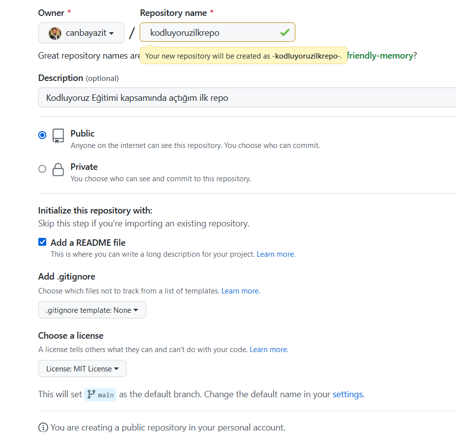

# Kodluyoruz İlk Repo
Bu repo [Kodluyoruz](https://www.kodluyoruz.org/) Front-End eğitiminde oluşturduğumuz ilk repo. İçerisinde bir adet READ.me dosyası bir adet de index.html dosyası barındırıyor.

# Installation
Öncelikle projeyi clonelayın.Öncelikle projeyi clonelayın. https://github.com/canbayazit/kodluyoruzilkrepo.git


```
git clone https://github.com/canbayazit/kodluyoruzilkrepo.git
```

# Usage

Projeyi Cloneladıktan sonra Visual Studio programında açınız.

Linux için : 

```
cd kodluyoruzilkrepo
code .
```

# Contributing 
Pull requestler kabul edilir. Büyük değişiklikler için , lütfen önce neyi değiştirmek istediğinizi tartışmak için bir konu açınız.

# License 
[MIT](https://choosealicense.com/)
